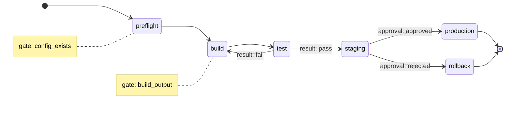

```mermaid
stateDiagram-v2
    direction LR
    [*] --> preflight
    build --> test
    preflight --> build
    staging --> production : approval: approved
    staging --> rollback : approval: rejected
    test --> staging : result: pass
    test --> build : result: fail
    production --> [*]
    rollback --> [*]
    note left of build
        gate: build_output
    end note
    note left of preflight
        gate: config_exists
    end note
```
