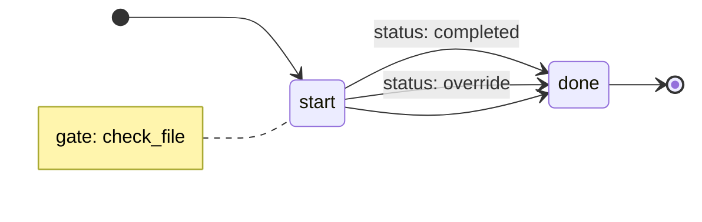

# QA Report: Issue #148 - koto template export mermaid fence wrapping

**Date**: 2026-05-03
**Binary**: `./target/release/koto` (built from commit on branch `main`)
**Template under test**: `test/functional/fixtures/templates/simple-gates.md`, `test/functional/fixtures/templates/multi-state.md`

## Acceptance Criteria

1. `koto template export template.md` (stdout, no --output) starts with ` ```mermaid ` and ends with ` ``` `
2. `koto template export template.md --output file.md` wraps in fence (was already true; should remain true)
3. The mermaid content itself (`stateDiagram-v2`) is still present inside the fence

## Results

| # | Scenario | Status |
|---|----------|--------|
| 1 | stdout output starts with ` ```mermaid ` | PASS |
| 2 | stdout output ends with ` ``` ` | PASS |
| 3 | stdout output contains `stateDiagram-v2` | PASS |
| 4 | `--output file.md` starts with ` ```mermaid ` | PASS |
| 5 | `--output file.md` ends with ` ``` ` | PASS |
| 6 | `--output file.md` contains `stateDiagram-v2` | PASS |

**Scenarios run**: 3 (acceptance criteria), 6 individual checks
**Scenarios passed**: 3 / 3
**Scenarios failed**: 0 / 3

## Command Output (stdout path)

```
$ ./target/release/koto template export test/functional/fixtures/templates/simple-gates.md
warning: state "start": gate "check_file" has no gates.* routing (legacy behavior)

```

First line of stdout: ` ```mermaid `
Last line of stdout: ` ``` `

## Command Output (--output file path)

```
$ ./target/release/koto template export test/functional/fixtures/templates/simple-gates.md --output /tmp/koto_test_export.md
warning: state "start": gate "check_file" has no gates.* routing (legacy behavior)
/tmp/koto_test_export.md
```

File contents match stdout mermaid block exactly (fence + stateDiagram-v2 content).

## Verdict

All acceptance criteria for issue #148 are met. The fix correctly applies markdown fence wrapping to the stdout path. The `--output` path was already correct and remains so.
